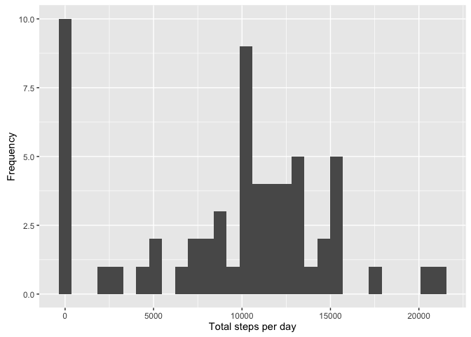
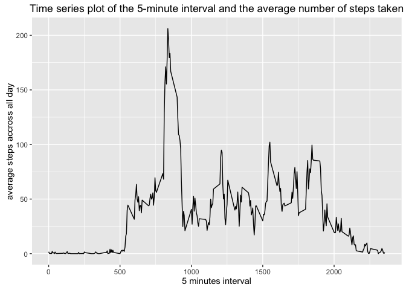
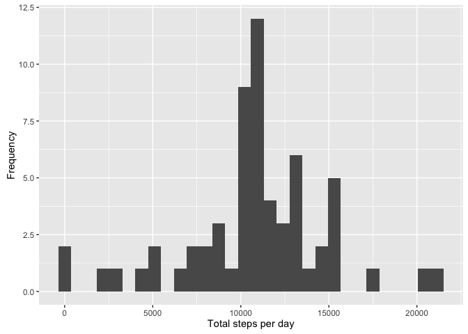
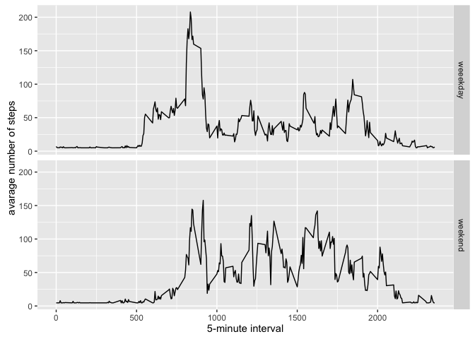

# Reproducible Research: Peer Assessment 1

```r
library(ggplot2)
```

```
## Warning: package 'ggplot2' was built under R version 3.2.4
```

```r
library(scales)
library(Hmisc)
```

```
## Loading required package: lattice
```

```
## Loading required package: survival
```

```
## Loading required package: Formula
```

```
## 
## Attaching package: 'Hmisc'
```

```
## The following objects are masked from 'package:base':
## 
##     format.pval, round.POSIXt, trunc.POSIXt, units
```
## Loading and preprocessing the data

```r
dataDir='/Users/asad/R/datasciencecoursera/RepResearch/RepData_PeerAssessment1/data/activity.csv'
data=read.csv(dataDir)
```


## What is mean total number of steps taken per day?

#### 1. The total number of steps taken per day calculation

```r
total<-tapply(data$steps,as.factor(data$date),sum,na.rm=TRUE)
```
#### 2. Histogram of the total number of steps taken each day

```r
qplot(total, xlab='Total steps per day', ylab='Frequency')
```

```
## `stat_bin()` using `bins = 30`. Pick better value with `binwidth`.
```


#### 3.Calculation and report the mean and median of the total number of steps taken per day

```r
mean_steps<-mean(total)
median_steps<-median(total)
print(mean_steps)
```

```
## [1] 9354.23
```

```r
print(median_steps)
```

```
## [1] 10395
```
## What is the average daily activity pattern?

#### 1. Make a time series plot (i.e. 𝚝𝚢𝚙𝚎 = "𝚕") of the 5-minute interval (x-axis) and the average number of steps taken, averaged across all days (y-axis)

```r
aggdata <-aggregate(data$steps, by=list(data$interval), 
  FUN=mean, na.rm=TRUE)
ggplot(data = aggdata, aes(x=Group.1, y=x)) + 
  geom_line()+
  labs( colour = "City",
        x = "5 minutes interval",
        y = "average steps accross all day",
        title = "Time series plot of the 5-minute interval and the average number of steps taken")
```


## 2. Which 5-minute interval, on average across all the days in the dataset, contains the maximum number of steps?

```r
 max_steps<-which.max(aggdata$x)
max_avg_step<-aggdata[max_steps,]$Group.1
timeMostSteps <-  gsub("([0-9]{1,2})([0-9]{2})", "\\1:\\2",max_avg_step)

 print(timeMostSteps)
```

```
## [1] "8:35"
```
## Imputing missing values

#### Calculate and report the total number of missing values in the dataset (i.e. the total number of rows with 𝙽𝙰s)

```r
missing_row<-sum(is.na(data$steps))
print(missing_row)
```

```
## [1] 2304
```
#### Devise a strategy for filling in all of the missing values in the dataset. The strategy does not need to be sophisticated. For example, you could use the mean/median for that day, or the mean for that 5-minute interval, etc.
#### Create a new dataset that is equal to the original dataset but with the missing data filled in.

```r
copied_data<-data
copied_data$steps<-impute(data$steps,fun=mean)
```
#### Make a histogram of the total number of steps taken each day and Calculate and report the mean and median total number of steps taken per day. Do these values differ from the estimates from the first part of the assignment? What is the impact of imputing missing data on the estimates of the total daily number of steps?

## 1. The total number of steps taken per day calculation

```r
total<-tapply(copied_data$steps,as.factor(copied_data$date),sum,na.rm=TRUE)
```
## 2. Histogram of the total number of steps taken each day

```r
qplot(total, xlab='Total steps per day', ylab='Frequency')
```

```
## `stat_bin()` using `bins = 30`. Pick better value with `binwidth`.
```


## 3.Calculation and report the mean and median of the total number of steps taken per day

```r
mean_steps<-mean(total)
median_steps<-median(total)
print(mean_steps)
```

```
## [1] 10766.19
```

```r
print(median_steps)
```

```
## [1] 10766.19
```
## Are there differences in activity patterns between weekdays and weekends?

```r
copied_data$dateType<-as.factor(ifelse(weekdays(as.Date(copied_data$date))%in% c("Saturday","Sunday"),"weekend","weeekday"))

averagedActivityDataImputed <- aggregate(steps ~ interval + dateType, data=copied_data, mean)
ggplot(averagedActivityDataImputed, aes(interval, steps)) + 
    geom_line() + 
    facet_grid(dateType ~ .) +
    xlab("5-minute interval") + 
    ylab("avarage number of steps")
```


